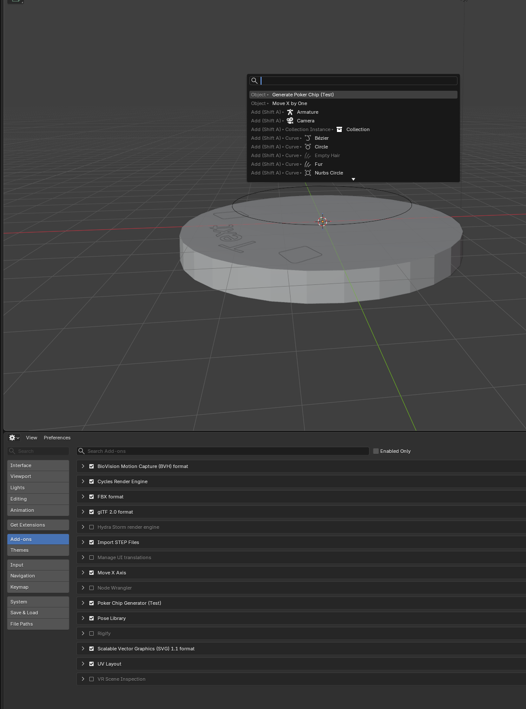

# 🎲 Blender-Chip-Gen
Automatically generate poker chips with pre-aligned text in Blender. Choose between the quick **shell script** (`png_to_blend.sh`) or the **Blender add-on** (`poker_chip_gen.py`).

> **⚠️ Note:** This is currently a **test version** with a generic text template and alignment. Future updates are intended to provide a cleaner text curve and take inputs for text and SVGs. 

## Features
- **Quick PNG-to-Blend Conversion:** Convert PNG images directly to Blender models with `png_to_blend.sh` (primary method).
- **One-Click Generation in Blender:** Use the `poker_chip_gen.py` add-on to generate chips directly within Blender (alternative method).
- **Automatic Setup:** Applies textures and modifiers to wrap text around the circular rim.
- **Undo Support:** Blender add-on fully supports Blender's undo stack (`bl_options = {'REGISTER', 'UNDO'}`).
- **Menu Integration:** Adds a "Generate Poker Chip (Test)" option to the **Object** menu (add-on only).

## 📸 Preview


## 🛠️ Installation

### Option 1: Using `png_to_blend.sh` (Recommended)

1. Clone or download this repository:
   ```bash
   git clone https://github.com/AperExanimus/Blender-Chip-Gen.git
   cd Blender-Chip-Gen
   ```
2. Ensure the script is executable:
   ```bash
   chmod +x png_to_blend.sh
   ```
3. Run the script with your PNG and SVG files:
   ```bash
   ./png_to_blend.sh your_image.png your_vector.svg
   ```
4. Open the generated `.blend` file in Blender.

### Option 2: Using `poker_chip_gen.py` as a Blender Add-on

1. Download the `poker_chip_gen.py` file from this repository.
2. Open **Blender**.
3. Determine add-on location with the following console commands:
   ```
   import addon_utils
   print(addon_utils.paths())
   ```
4. Go to **Edit** > **Preferences** > **Add-ons**.
5. Click the **Install...** button.
6. Navigate to and select `poker_chip_gen.py`.
7. Check the box next to **Object: Poker Chip Generator (Test)** to enable it.

## Usage

### Using `png_to_blend.sh`

```bash
./png_to_blend.sh input.png input.svg
```

The script will process your PNG along with your STL file to create a combined Blender file ready to use.

### Using the Blender Add-on

1. Ensure you are in the **Object Mode**.
2. Go to the top menu bar: **Object** > **Generate Poker Chip (Test)**.
   *(Alternatively, press `F3` and search for "Generate Poker Chip")*.
3. The addon will generate:
   - A **Cylinder** (Base)
   - A **Bezier Circle** (Rim guide)
   - A **Text Object** (Wrapped around the rim)

## 📂 File Structure
- `png_to_blend.sh`: Main shell script for converting PNG files to Blender models.
- `poker_chip_gen.py`: Blender add-on script (alternative method).
- `README.md`: This documentation file.

## 🔧 Technical Details
- **Blender Version:** Compatible with Blender 2.80 and newer.
- **Category:** Object Tools.
- **png_to_blend.sh Logic:**
  - Processes PNG files and converts them to Blender-compatible formats.
  - Generates required geometry and applies textures.
- **poker_chip_gen.py Logic:**
  - Creates a cylinder at `(0, 0, -0.31)` with scaled dimensions.
  - Generates a Bezier circle and resizes it to act as a path.
  - Adds text "♦ Text ♦" and applies a **Curve Modifier** using the circle.

## 🚧 Roadmap / TODOs
- [ ] Add a UI Panel in the Sidebar (`N` panel) to adjust:
  - Text Content
  - Font Size
- [ ] Add automated stencil generation for easier post-processing of 3D printed objects. 

## 📄 License
This project is provided as-is for educational and testing purposes. Feel free to modify and distribute.

## 🤝 Contributing
Found a bug or have a feature request? Please open an **Issue** on GitHub!
